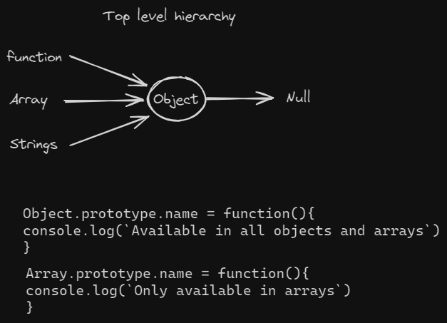

## JavaScript and Class

## OOP(Object oriented programming)
Is a paradigm that use object to represent data and functionality, making it more modular, reuseable and easier to understand.
 
 ## Object
  collection of properties and method.

Part of OOP
- Object literals
- Constructor function
- Prototypes
  - 

- Instances(new, this)

Pillars of OOP
- Abstraction
- Encapsulation
- Inheritance
- Polymorphism
